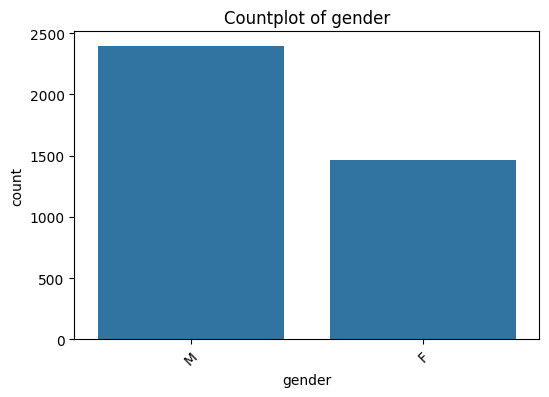

# Laporan Proyek Machine Learning Terapan - Stephen Helenus

## Domain Proyek

Masalah klasifikasi antara perokok dan bukan perokok merupakan isu penting dalam bidang kesehatan masyarakat, mengingat dampak negatif merokok terhadap kesehatan individu dan beban ekonomi yang ditimbulkannya. Menurut **[World Health Organization (2023)](https://www.who.int/news-room/fact-sheets/detail/tobacco)**, merokok meningkatkan risiko berbagai penyakit serius seperti penyakit jantung, stroke, kanker paru-paru, dan penyakit paru obstruktif kronik (PPOK). Bahkan perokok ringan pun mengalami penurunan kualitas hidup yang signifikan dibandingkan dengan non-perokok, sebagaimana dijelaskan dalam studi oleh **[Streppel et al. (2007)](https://www.ncbi.nlm.nih.gov/pmc/articles/PMC2865193/)**.

Untuk mengatasi permasalahan ini, pendekatan berbasis teknologi seperti pembelajaran mesin (machine learning) telah digunakan untuk mengklasifikasikan status merokok individu berdasarkan data biomarker tubuh. Dalam proyek ini, fitur-fitur fisiologis seperti usia (`age`), berat badan (`weight`), tekanan darah sistolik dan diastolik (`systolic`, `relaxation`), kadar hemoglobin (`hemoglobin`), kadar kreatinin serum (`serum creatinine`), dan enzim hati Gamma-GTP (`Gtp`) digunakan sebagai variabel prediktor. Studi oleh **[Kim et al. (2023)](https://www.ncbi.nlm.nih.gov/pmc/articles/PMC10249849/)** menunjukkan bahwa ciri-ciri biometrik dan klinis seperti ini dapat memberikan kontribusi signifikan dalam mendeteksi kebiasaan merokok melalui klasifikasi berbasis pembelajaran mesin.

Dengan demikian, pengembangan sistem klasifikasi perokok menggunakan data biomarker tubuh tidak hanya memberikan manfaat dalam konteks individu, tetapi juga berkontribusi pada upaya kesehatan masyarakat yang lebih luas untuk mengurangi prevalensi merokok dan meningkatkan kualitas hidup.

## Business Understanding

### Problem Statements

- Bagaimana cara mengidentifikasi seseorang sebagai perokok atau bukan perokok berdasarkan data biomarker tubuh seperti usia, berat badan, tekanan darah, kadar hemoglobin, serum kreatinin, dan enzim GTP?

- Apakah model klasifikasi yang dibangun mampu mengidentifikasi status merokok dengan akurasi yang tinggi dan dapat digunakan untuk membantu intervensi kesehatan secara dini?

- Fitur-fitur fisiologis apa yang paling berpengaruh dalam membedakan antara perokok dan bukan perokok?


### Goals

- Mengembangkan model klasifikasi menggunakan data biomarker untuk memprediksi apakah seseorang merupakan perokok atau bukan.

- Membangun model yang mampu memberikan prediksi dengan performa wajar, di mana model terbaik (SVM setelah tuning) mencapai akurasi sekitar 73.6% dan F1-score 59.5%, yang dapat menjadi dasar awal untuk pengembangan sistem skrining kesehatan yang lebih baik.

- Menganalisis performa dan kontribusi dua model berbeda (Logistic Regression dan SVM) untuk memahami kelebihan dan keterbatasannya dalam klasifikasi status merokok.

### Solution statements
- Proyek ini menggunakan dua algoritma klasifikasi biner, yaitu Logistic Regression dan Support Vector Machine (SVM), untuk memprediksi status perokok berdasarkan data biomarker.

- Dilakukan penyetelan parameter menggunakan GridSearchCV dengan 5-fold cross-validation.
    - Logistic Regression: tuning C dan solver.
    - SVM: tuning C, kernel, dan gamma.

- Model Logistic Regression dan SVM yang telah dituning dievaluasi kembali terhadap data uji. Hasil evaluasi digunakan untuk memilih model terbaik berdasarkan trade-off antara akurasi dan metrik lainnya. Seluruh hasil evaluasi dirangkum dalam sebuah tabel performa sebagai bagian dari proses dokumentasi dan interpretasi hasil

## Data Understanding
Dataset Body Signal of Smoking adalah kumpulan data sinyal biologis dasar yang berisi 55.692 sampel dengan 27 fitur, yang mencakup informasi kesehatan seperti usia, jenis kelamin, tekanan darah, kadar kolesterol, fungsi hati, hingga status kesehatan mulut. 

Dataset ini bertujuan untuk mengembangkan model klasifikasi yang dapat menentukan status merokok seseorang hanya berdasarkan data biologis tersebut. Dengan menggunakan data ini, model diharapkan dapat membantu deteksi dini risiko kesehatan terkait kebiasaan merokok dan mendukung penelitian kesehatan masyarakat.

Berikut tautan dataset yang digunakan.
[https://www.kaggle.com/datasets/kukuroo3/body-signal-of-smoking](https://www.kaggle.com/datasets/kukuroo3/body-signal-of-smoking)

### Variabel-variabel pada Body Signal of Smoking dataset adalah sebagai berikut:

- `ID` : Index atau identifikasi unik untuk setiap individu
- `gender` : Jenis kelamin
- `age` : Kelompok usia dalam rentang 5 tahun
- `height(cm)` : Tinggi badan dalam satuan sentimeter
- `weight(kg)` : Berat badan dalam satuan kilogram
- `waist(cm)` : Lingkar pinggang dalam sentimeter
- `eyesight(left)` : Ketajaman penglihatan mata kiri
- `eyesight(right)` : Ketajaman penglihatan mata kanan
- `hearing(left)` : Status pendengaran telinga kiri
- `hearing(right)` : Status pendengaran telinga kanan
- `systolic` : Tekanan darah sistolik (angka atas)
- `relaxation` : Tekanan darah diastolik (angka bawah)
- `fasting blood sugar` : Kadar gula darah setelah puasa
- `Cholesterol` : Kadar kolesterol total dalam darah
- `triglyceride` : Kadar trigliserida dalam darah
- `HDL` : High-Density Lipoprotein (kolesterol baik)
- `LDL` : Low-Density Lipoprotein (kolesterol jahat)
- `hemoglobin` : Kadar hemoglobin dalam darah
- `Urine protein` : Kandungan protein dalam urin
- `serum creatinine` : Kadar kreatinin dalam serum darah
- `AST` : Jenis enzim hati Aspartate Transaminase
- `ALT` : Jenis enzim hati Alanine Transaminase
- `Gtp` : Gamma-Glutamyl Transferase (γ-GTP), indikator fungsi hati
- `oral` : Status pemeriksaan mulut
- `dental caries` : Status adanya gigi berlubang
- `tartar` : Status keberadaan karang gigi
- `smoking` : Status merokok (1 = perokok, 0 = bukan perokok)

Kolom yang digunakan hanya beberapa. Penjelasan lebih lanjut terdapat di **Data Preparation**.

### Visualisasi Distribusi Data Numerik


Pada visualisasi tersebut, saya telah melakukan penanganan outlier. Outlier saya hilangkan dengan menggunakan metode Interquartile Range (IQR). Caranya adalah dengan menghitung kuartil pertama (Q1) dan kuartil ketiga (Q3) untuk setiap kolom numerik, kemudian menentukan rentang IQR sebagai selisih antara Q3 dan Q1. Data yang berada di luar batas bawah (Q1 - 1.5 × IQR) dan batas atas (Q3 + 1.5 × IQR) dianggap sebagai outlier dan dihapus dari dataset. Dengan cara ini, nilai-nilai ekstrem yang bisa mengganggu analisis data dan model prediksi dapat diminimalisir sehingga hasil analisis menjadi lebih valid dan representatif terhadap pola data yang sebenarnya.

Kemudian dalam histogram di sebelah kiri adalah banyaknya data dari masing-masing kolom.

### Visualisasi Distribusi Data Kategorikal



Kemudian, pada visualisasi di atas, setiap plot berupa countplot yang menggambarkan banyaknya data atau frekuensi dari masing-masing kategori pada setiap kolom kategorikal. Sumbu-x menunjukkan kategori yang ada pada kolom tersebut, sedangkan sumbu-y menunjukkan jumlah data untuk tiap kategori. Urutan kategori diatur berdasarkan frekuensi terbanyak ke yang paling sedikit agar lebih mudah dilihat distribusinya. Rotasi label pada sumbu-x sebesar 45 derajat dilakukan agar teks kategori tidak saling bertumpuk dan tetap terbaca dengan jelas. Dengan visualisasi ini, kita dapat dengan cepat memahami proporsi dan distribusi data kategorikal dalam dataset sebelum melakukan analisis lebih lanjut.

## Visualisasi Korelasi Antar Variabel


Korelasi antar variabel dihitung setelah kolom kategorikal di-**encode** menjadi numerik dan fitur numerik di-**standarisasi** menggunakan **StandardScaler**. Proses ini memastikan semua data berada dalam skala yang sama sehingga korelasi yang dihasilkan akurat dan mudah diinterpretasi, termasuk hubungan antar fitur maupun dengan variabel target.

Berikut kode program Encoding dan Standarisasi.
- Encoding Fitur Kategorikal
    ```python
    label_encoder = LabelEncoder()

    categorical_columns = ['gender', 'tartar']

    for column in categorical_columns:
        df[column] = label_encoder.fit_transform(df[column])

    df.head()
    ```

- Standarisasi Fitur Numerik
    ```python
    scaler = StandardScaler()

    X = df.drop(columns=['smoking'])
    y = df['smoking']

    numeric_columns = X.select_dtypes(include=['int64', 'float64']).columns
    X[numeric_columns] = scaler.fit_transform(X[numeric_columns])
    ```

## Data Preparation
Berikut ini adalah beberapa tahap yang dilakukan sebagai berikut:

- `Load Data :` 
    Dataset yang digunakan adalah sebanyak 5555692 data. Hal ini akan sangat lama jika saya menggunakan semua kolom. Oleh sebab itu, pada proyek ini saya hanya mengambil 5000 data. 
    
    ```python
    df = pd.read_csv('smoking.csv')
    df = df.sample(n=5000, random_state=42)
    ```

    Saya menggunakan **randon_state** untuk mengambil acak alias agar bervariasi.
    <br>

- `Feature Selection :` 
    Selanjutnya pada tahap ini yang dilakukan adalah menghapus beberapa kolom yang dianggap tidak relevan terhadap target prediksi, seperti kolom identitas, tinggi badan, penglihatan, pendengaran, dan beberapa indikator kesehatan lainnya.

    ```python
    df = df.drop(columns=[
        'ID', 'height(cm)', 'waist(cm)', 'eyesight(left)', 'eyesight(right)',
        'hearing(left)', 'hearing(right)', 'fasting blood sugar', 'Cholesterol',
        'triglyceride', 'HDL', 'LDL', 'Urine protein', 'AST', 'ALT', 'oral', 'dental caries'
    ])
    ```
    <br>

- `Cek NULL dan Duplikasi :` 
    Kemudian dilakukan pengecekan terhadap data kosong dan data duplikat. Seluruh baris yang mengandung nilai kosong dan duplikat dihapus agar data lebih bersih dan tidak bias.

    ```python
    df.isnull().sum()
    df.dropna(inplace=True)

    df.duplicated().sum()
    df.drop_duplicates(inplace=True)
    ```

    Hal ini perlu dilakukan untuk menjaga kualitas data. Data kosong dapat menyebabkan model belajar informasi yang salah atau tidak lengkap.
    <br>

- `Penanganan Outlier :` 
    Pendeteksian outlier dilakukan dengan metode IQR (Interquartile Range). Outlier adalah data yang berada di luar batas bawah dan atas (Q1 - 1.5 * IQR dan Q3 + 1.5 * IQR) yang kemudian dihapus untuk menjaga konsistensi dan kestabilan model.

    ```python
    numeric_columns = df.select_dtypes(include=['number']).columns

    n_cols = 2  # jumlah kolom subplot
    n_rows = math.ceil(len(numeric_columns) / n_cols)  # hitung jumlah baris yang diperlukan

    plt.figure(figsize=(n_cols * 6, n_rows * 4))

    for i, col in enumerate(numeric_columns, 1):
        plt.subplot(n_rows, n_cols, i)
        sns.boxplot(y=df[col], color="skyblue")
        plt.title(f"Boxplot of {col}")

        Q1 = df[col].quantile(0.25)
        Q3 = df[col].quantile(0.75)
        IQR = Q3 - Q1

        lower_bound = Q1 - 1.5 * IQR
        upper_bound = Q3 + 1.5 * IQR

        outliers = df[(df[col] < lower_bound) | (df[col] > upper_bound)]
        print(f"{col} column: {len(outliers)} outlier")

    plt.tight_layout()
    plt.show()
    ```

    ```python
    columns_to_check = df.select_dtypes(include=['number']).columns

    def remove_outliers(df, columns):
        for col in columns:
            Q1 = df[col].quantile(0.25)
            Q3 = df[col].quantile(0.75)
            IQR = Q3 - Q1

            lower_bound = Q1 - 1.5 * IQR
            upper_bound = Q3 + 1.5 * IQR

            df = df[(df[col] >= lower_bound) & (df[col] <= upper_bound)]

        return df

    df = remove_outliers(df, columns_to_check)
    ```

    Pada kode pertama adalah kode program untuk menampilkan outlier yang terdapat pada masing-masing kolom. Lalu pada kode kedua adalah bagaimana cara menghilangkan outlier. 

    <br>
    
    Outlier dapat membuat distribusi data menjadi tidak normal sehingga memengaruhi kinerja model, terutama model berbasis statistik. lalu model bisa terlalu fokus pada data ekstrem jika outlier tidak dihapus.

    Itulah mengapa outlier sebaiknya dihilangkan karena model akan lebih stabil dan akurat jika dilatih pada data yang konsisten.

    <br>

- `Encoding dan Standarisasi :` 
    Encoding adalah proses mengubah data kategorikal menjadi format numerik. Sebaliknya, Standarisasi adalah proses mengubah skala data numerik agar memiliki nilai rata-rata (mean) = 0 dan standar deviasi = 1.

    <br>

    Hal ini dilakukan karena algoritma machine learning tidak bisa langsung memproses data bertipe string atau kategori. Kemudian fitur dengan skala besar dapat mendominasi perhitungan dan mengganggu model jika tidak distandarisasi.

    ```python
    label_encoder = LabelEncoder()

    categorical_columns = ['gender', 'tartar']

    for column in categorical_columns:
        df[column] = label_encoder.fit_transform(df[column])

    df.head()
    ```

    ```python
    scaler = StandardScaler()

    X = df.drop(columns=['smoking'])
    y = df['smoking']

    numeric_columns = X.select_dtypes(include=['int64', 'float64']).columns
    X[numeric_columns] = scaler.fit_transform(X[numeric_columns])
    ```

-  `Data Splitting :` 
    Data splitting atau pemisahan data adalah metode membagi data menjadi dua bagian atau lebih yang membentuk subhimpunan data.

    - Training set (80%): Digunakan untuk melatih model.
    - Test set (20%): Digunakan untuk mengukur performa model pada data yang belum pernah dilihat sebelumnya.

    ```python
    # Split data menjadi set pelatihan dan set uji
    X_train, X_test, y_train, y_test = train_test_split(X, y, test_size=0.2, random_state=42)

    # Tampilkan bentuk set pelatihan dan set uji untuk memastikan split
    print(f"Training set shape: X_train={X_train.shape}, y_train={y_train.shape}")
    print(f"Test set shape: X_test={X_test.shape}, y_test={y_test.shape}")
    ```

    Dengan memisahkan data pelatihan dan pengujian, kita bisa mengetahui apakah model bekerja baik hanya pada data latih atau juga pada data baru yang belum pernah dilihat.

## Modeling

Pada tahap modeling, dilakukan pembangunan model machine learning untuk menyelesaikan permasalahan klasifikasi apakah seseorang merupakan perokok atau bukan. Dataset dibagi terlebih dahulu menjadi dua bagian menggunakan `train_test_split`, yaitu **training set** (80%) dan **test set** (20%) untuk memastikan model dievaluasi secara objektif terhadap data yang belum pernah dilihat.

### Algoritma yang Digunakan

Dua algoritma yang digunakan dalam proyek ini adalah **Logistic Regression (LR)** dan **Support Vector Machine (SVM)**. Berikut penjelasan mengenai cara kerja dari masing-masing algoritma:

#### 1. Logistic Regression

Logistic Regression adalah algoritma klasifikasi linier yang digunakan untuk memprediksi probabilitas suatu data termasuk ke dalam kelas tertentu. Model ini menggunakan **fungsi sigmoid (logistic function)** yang memetakan nilai input menjadi nilai antara 0 dan 1, yang kemudian dapat diinterpretasikan sebagai probabilitas.

Rumus fungsi sigmoid:

$$
\sigma(z) = \frac{1}{1 + e^{-z}}
$$

di mana $z = w^T x + b$, yaitu kombinasi linier dari fitur-fitur input.

Logistic Regression menentukan batas keputusan (decision boundary) berdasarkan probabilitas tersebut, dan mengklasifikasikan data ke kelas positif (misalnya, perokok) jika probabilitas melebihi threshold tertentu (biasanya 0.5).

#### 2. Support Vector Machine (SVM)

SVM adalah algoritma klasifikasi yang bekerja dengan mencari **hyperplane** terbaik yang memisahkan dua kelas data dengan margin terbesar. Tujuan dari SVM adalah **memaksimalkan margin**, yaitu jarak antara hyperplane dengan data dari masing-masing kelas terdekat, yang disebut **support vectors**.

Untuk kasus data yang tidak dapat dipisahkan secara linier, SVM menggunakan **fungsi kernel** (seperti RBF atau polynomial) untuk memetakan data ke ruang berdimensi lebih tinggi di mana pemisahan menjadi lebih mudah.

Beberapa istilah penting dalam SVM:

* **Hyperplane**: garis (2D) atau bidang (3D) yang menjadi batas pemisah antar kelas.
* **Support Vectors**: titik-titik data yang paling dekat dengan hyperplane.
* **Margin**: jarak antara support vectors ke hyperplane, yang ingin dimaksimalkan.

### Pelatihan Awal Model

Model Logistic Regression dan SVM pertama-tama dilatih menggunakan parameter default untuk mendapatkan baseline performa awal.

```python
lr = LogisticRegression().fit(X_train, y_train)
svm = SVC().fit(X_train, y_train)
```

Evaluasi dilakukan menggunakan metrik umum seperti Accuracy, Precision, Recall, dan F1-Score.

```python
# Fungsi untuk mengevaluasi model
def evaluate_model(model, X_test, y_test):
    y_pred = model.predict(X_test)
    cm = confusion_matrix(y_test, y_pred)
    tn, fp, fn, tp = cm.ravel()
    results = {
        'Confusion Matrix': cm,
        'True Positive (TP)': tp,
        'False Positive (FP)': fp,
        'False Negative (FN)': fn,
        'True Negative (TN)': tn,
        'Accuracy': accuracy_score(y_test, y_pred),
        'Precision': precision_score(y_test, y_pred),
        'Recall': recall_score(y_test, y_pred),
        'F1-Score': f1_score(y_test, y_pred)
    }
    return results
```

Berikut hasil evaluasi awal sebelum tuning:

| Model                        | Accuracy | Precision | Recall   | F1-Score |
| ---------------------------- | -------- | --------- | -------- | -------- |
| Logistic Regression (LR)     | 0.714101 | 0.584071  | 0.712230 | 0.641815 |
| Support Vector Machine (SVM) | 0.720569 | 0.589595  | 0.733813 | 0.653846 |

### Hyperparameter Tuning

Untuk meningkatkan performa, dilakukan **hyperparameter tuning** menggunakan `GridSearchCV`:

```python
param_grid_lr = {
    'C': [0.01, 0.1, 1, 10],
    'solver': ['liblinear', 'lbfgs']
}

param_grid_svm = {
    'C': [0.1, 1, 10],
    'kernel': ['linear', 'rbf'],
    'gamma': ['scale', 'auto']
}
```

Setelah tuning, berikut hasil evaluasi model yang diperoleh:

| Model                          | Accuracy | Precision | Recall   | F1-Score |
| ------------------------------ | -------- | --------- | -------- | -------- |
| Logistic Regression (Tuned)    | 0.721863 | 0.591304  | 0.733813 | 0.654896 |
| Support Vector Machine (Tuned) | 0.719276 | 0.577608  | 0.816547 | 0.676602 |

### Model Terbaik

Model **Support Vector Machine (Tuned)** dipilih sebagai solusi utama karena memberikan **F1-Score dan Recall tertinggi**, menunjukkan kemampuannya dalam mendeteksi perokok secara andal. Nilai recall yang tinggi penting dalam konteks ini, karena berarti model mampu mengenali sebagian besar individu yang benar-benar merupakan perokok, yang krusial dalam skenario pencegahan atau intervensi kesehatan.

## Evaluation
Pada tahap evaluasi ini, digunakan beberapa metrik untuk mengukur kinerja model klasifikasi dalam membedakan antara perokok dan bukan perokok. Metrik yang digunakan meliputi:

### Metrik Evaluasi yang Digunakan
1. **Accuracy**  
   Merupakan rasio prediksi yang benar terhadap seluruh prediksi yang dilakukan.  
   $$ \text{Accuracy} = \frac{TP + TN}{TP + TN + FP + FN} $$  
   Cocok digunakan saat data seimbang, namun dapat menyesatkan pada data yang tidak seimbang.

2. **Precision**  
   Mengukur seberapa tepat model dalam memprediksi kelas positif.  
   $$ \text{Precision} = \frac{TP}{TP + FP} $$  
   Metrik ini penting jika kesalahan positif palsu (False Positive) berdampak besar.

3. **Recall**  
   Mengukur seberapa baik model menemukan seluruh kasus positif yang sebenarnya.  
   $$ \text{Recall} = \frac{TP}{TP + FN} $$  
   Cocok digunakan jika kita tidak ingin melewatkan kasus positif (False Negative).

4. **F1-Score**  
   Merupakan harmonic mean dari Precision dan Recall.  
   $$ \text{F1-Score} = 2 \cdot \frac{Precision \cdot Recall}{Precision + Recall} $$  
   Berguna saat dibutuhkan keseimbangan antara Precision dan Recall.

### Hasil Evaluasi Model
Berikut adalah ringkasan metrik dari empat model yang diuji:

| Model                         | Accuracy | Precision | Recall  | F1-Score |
|-------------------------------|----------|-----------|---------|----------|
| Logistic Regression (LR)       | 0.7141   | 0.5841    | 0.7122  | 0.6418   |
| Support Vector Machine (SVM)   | 0.7206   | 0.5896    | 0.7338  | 0.6538   |
| Logistic Regression (Tuned)    | 0.7219   | 0.5913    | 0.7338  | 0.6549   |
| Support Vector Machine (Tuned) | 0.7193   | 0.5776    | 0.8165  | 0.6766   |

### Interpretasi Hasil
- **SVM (Tuned)** menghasilkan F1-Score tertinggi (0.6766), menunjukkan performa yang baik dalam menyeimbangkan Precision dan Recall.  
- Model **Logistic Regression (Tuned)** juga menunjukkan performa yang stabil dengan nilai akurasi dan F1-Score yang cukup tinggi.  
- Semua model mengalami peningkatan performa setelah dilakukan **hyperparameter tuning**, membuktikan pentingnya proses ini dalam meningkatkan akurasi klasifikasi.

### Classification Report
- Logistic Regression (Tuned)
    

    | Class        | Precision | Recall | F1-Score | Support |
    | ------------ | --------- | ------ | -------- | ------- |
    | 0            | 0.83      | 0.72   | 0.77     | 495     |
    | 1            | 0.59      | 0.73   | 0.65     | 278     |
    | **Accuracy** |           |        | **0.72** | 773     |
    | Macro Avg    | 0.71      | 0.72   | 0.71     | 773     |
    | Weighted Avg | 0.74      | 0.72   | 0.73     | 773     |

- Support Vector Machine (Tuned)
    

    | Class        | Precision | Recall | F1-Score | Support |
    | ------------ | --------- | ------ | -------- | ------- |
    | 0            | 0.87      | 0.66   | 0.75     | 495     |
    | 1            | 0.58      | 0.82   | 0.68     | 278     |
    | **Accuracy** |           |        | **0.72** | 773     |
    | Macro Avg    | 0.72      | 0.74   | 0.71     | 773     |
    | Weighted Avg | 0.76      | 0.72   | 0.72     | 773     |

### Kesimpulan
Model terbaik berdasarkan **kemampuan mendeteksi perokok (kelas 1)** adalah **Support Vector Machine (SVM) dengan hyperparameter tuning**. Meskipun kedua model memiliki akurasi yang sama (0.72), **SVM menunjukkan performa yang lebih baik dalam mengenali perokok**, dibuktikan dengan nilai **recall yang lebih tinggi (0.82 vs 0.73)** dan **F1-Score kelas 1 yang lebih unggul (0.68 vs 0.65)** dibandingkan Logistic Regression.

Dalam konteks klasifikasi perokok, di mana penting untuk **meminimalkan kesalahan tipe II (false negative)** — yaitu gagal mendeteksi perokok — maka model **SVM (Tuned)** lebih sesuai. Model ini lebih sensitif dalam mendeteksi perokok meskipun dengan sedikit penurunan pada precision. Oleh karena itu, **SVM menjadi pilihan yang lebih optimal untuk kasus ini**, terutama jika fokus utama adalah deteksi perokok secara efektif.
